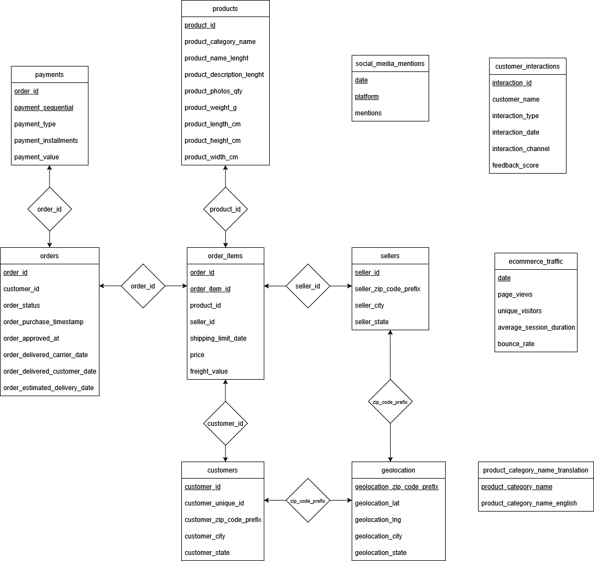

# E-Commerce Analytics System with LLM-Augmented Intelligence

AI-Powered E-Commerce Analytics Platform

CommerceLens is a cloud-deployed analytics platform that combines PostgreSQL, Python, and Large Language Models to transform raw e-commerce data into actionable business intelligence.

Built on a large-scale Brazilian e-commerce dataset, the platform integrates structured analytics, automated reporting, customer sentiment analysis, and interactive dashboards to help stakeholders understand sales performance, customer behavior, operational efficiency, and market trends.

🔗 **Live App**: [https://dashboardpy-kd6kgsdnkpzg5s7wjd3uaf.streamlit.app/](https://dashboardpy-kd6kgsdnkpzg5s7wjd3uaf.streamlit.app/)

---

## Dataset

This project uses the **Brazilian E-Commerce Public Dataset** extended with custom data files for richer analytics.

- Customer profiles and purchase history
- Order items, product details, and categories
- Sellers and geolocation data
- Payment methods and transaction values
- Customer interactions, feedback scores, and web/social traffic

**Dataset Download**:
[https://www.mediafire.com/file/j3yn49hxmsvklpk/Data.zip/file](https://www.mediafire.com/file/j3yn49hxmsvklpk/Data.zip/file)

---

Overview

Modern e-commerce organizations generate enormous volumes of transactional and customer interaction data. While traditional SQL analytics can reveal trends and metrics, extracting business insights often requires manual interpretation.

CommerceLens bridges this gap by combining relational database analytics with LLM-powered intelligence, enabling both quantitative reporting and natural-language business insights.

The system supports:

Advanced SQL analytics
Customer behavior analysis
Seller performance evaluation
Order and payment tracking
AI-generated executive summaries
Customer sentiment intelligence
Interactive cloud-hosted dashboards
Key Features
Business Analytics
Sales trend analysis
Revenue monitoring
Customer segmentation
Seller performance tracking
Delivery performance reporting
Product category analysis
Payment behavior insights
Database Engineering
Normalized relational schema
Multi-table analytical queries
Stored procedures
Database triggers
Query optimization
Index-based performance tuning
AI-Powered Intelligence
Customer feedback summarization
Complaint categorization
Automated executive reporting
Natural language business insights
Trend interpretation using LLMs
Interactive Dashboard
Real-time visual analytics
KPI monitoring
Executive reporting interface
Interactive business intelligence views

### ER Diagram



---

## Phase 2: LLM-Augmented Intelligence ✅

The system is extended with **LLaMA 3 via Groq API** to extract insights from unstructured customer data and generate human-readable reports.

### Features Implemented
- **Customer Feedback Summariser** — Analyses recent interaction records and summarises sentiment and themes
- **Issue Classifier** — Classifies free-text customer complaints into categories (Delivery, Quality, Payment, etc.)
- **Monthly Executive Report Generator** — Pulls key metrics from PostgreSQL and generates a professional business summary

### Technologies Used
- Groq API (LLaMA 3.3 70B) — free tier
- Python (`groq` SDK)
- `psycopg2` for PostgreSQL connectivity

---

## Phase 3: Cloud Deployment ✅

The full system is deployed to the cloud using a free-tier stack with no payment details required.

| Component | Service |
|-----------|---------|
| Database | Supabase (PostgreSQL, free tier) |
| LLM | Groq API (LLaMA 3.3 70B, free tier) |
| Dashboard | Streamlit Community Cloud (free tier) |

### Data Migrated to Supabase
- 99,442 orders
- 1,000,163 geolocation records
- 112,650 order items
- 3,000 customers
- 3,001 sellers
- 99,441 products
- 103,886 payments
- 32,951 social media mentions
- 3,095 ecommerce traffic records
- 3,000 customer interactions

---

## Local Setup

### Prerequisites
- Python 3.10+
- PostgreSQL (local) or Supabase account
- Groq API key (free at [https://console.groq.com](https://console.groq.com))

Installation
Clone Repository
git clone https://github.com/yourusername/commercelens.git
cd commercelens
Install Dependencies
pip install -r requirements.txt
Configure Environment Variables

Create a .env file:

DB_HOST=your_database_host
DB_PORT=5432
DB_NAME=postgres
DB_USER=your_database_user
DB_PASSWORD=your_database_password

GROQ_API_KEY=your_groq_api_key
Running the Application

Launch the dashboard:

streamlit run dashboard.py

The application will be available locally at:

http://localhost:8501

### Common Setup Issue: CSV Path / Permission Error in PostgreSQL

When loading CSVs using the `COPY` command you may encounter:
```
ERROR: could not open file "..." for reading: Permission denied
```

**Solution**: Move CSV files to `C:\pg_import\` and update paths in `load_create.sql` to use forward slashes:
```sql
COPY customers FROM 'C:/pg_import/customers.csv' WITH (FORMAT csv, HEADER true);
```

Alternatively use pgAdmin: **Right-click table → Import/Export Data → Select CSV → Enable Header**

---

## Project Status

- ✅ SQL infrastructure and analytics system completed
- ✅ LLM integration completed (Groq API — LLaMA 3.3 70B)
- ✅ Streamlit dashboard completed
- ✅ Full cloud deployment live

---

## Project Status

- ✅ SQL infrastructure and analytics system completed
- ✅ LLM integration completed (Groq API — LLaMA 3.3 70B)
- ✅ Streamlit dashboard completed
- ✅ Full cloud deployment live
